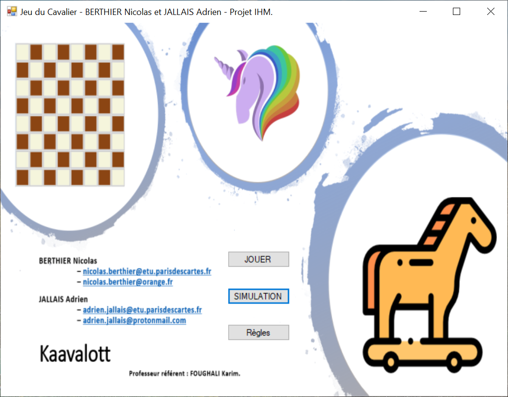
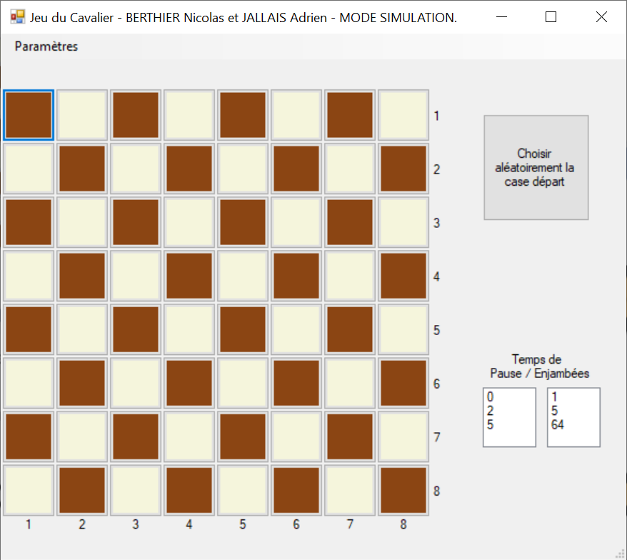
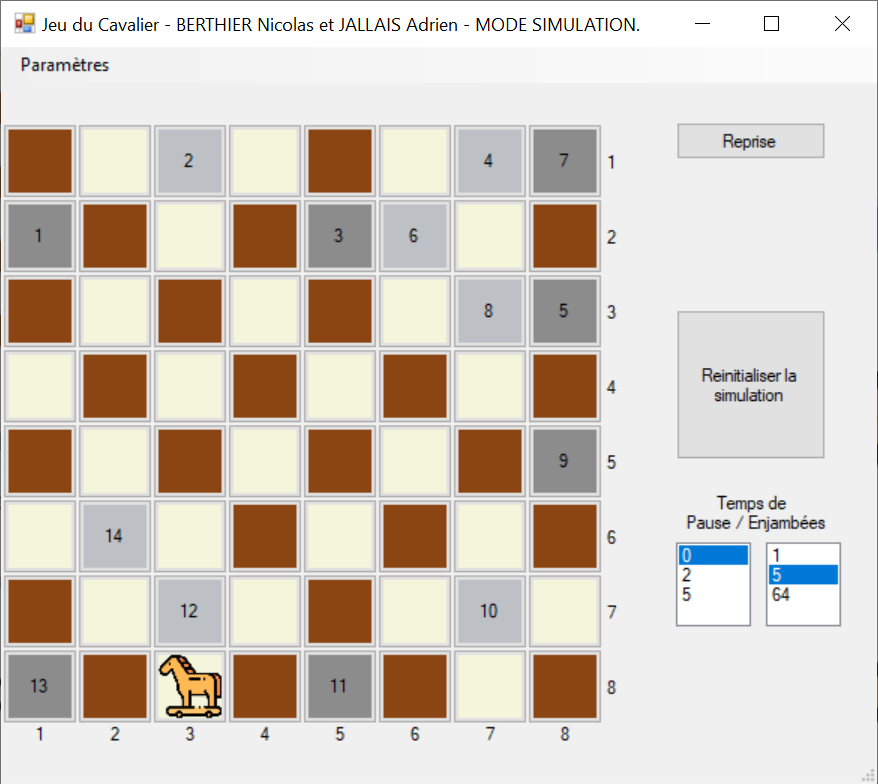
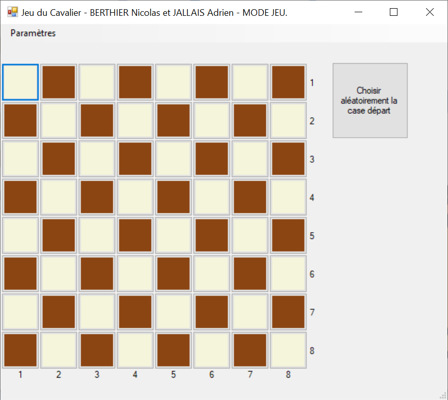
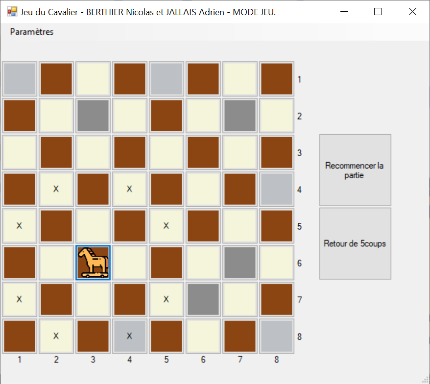
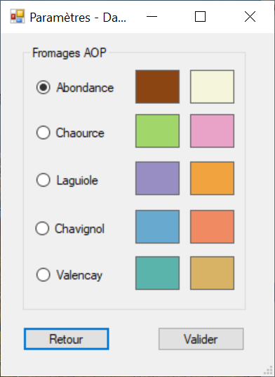
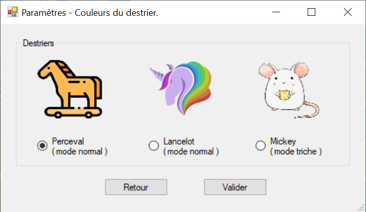
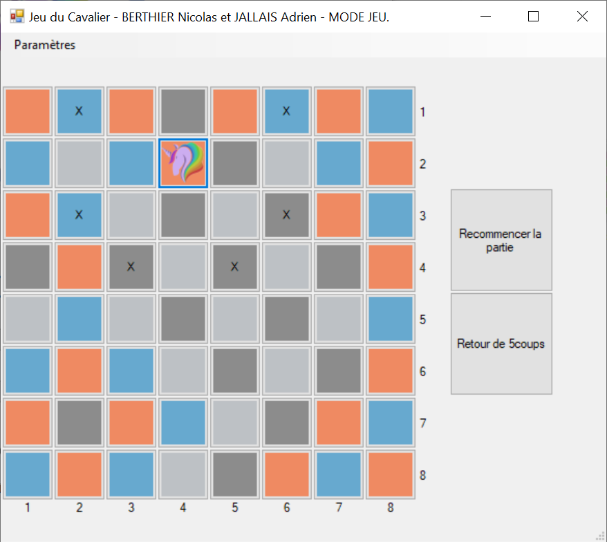
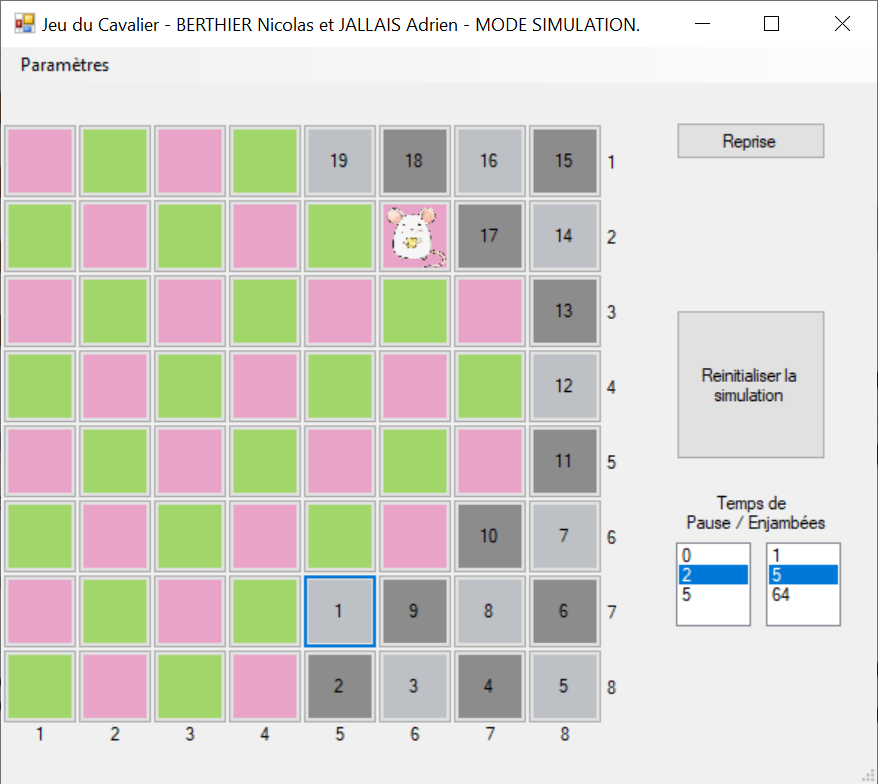

# IHM-Cavalier

IUT Paris Descartes - 2019 - Enseignant : FOUGHALI Karim.

## Application graphique WinForms en C#.

Dans le cadre du cours de Interface Homme-Machine en C#, Karim Foughali a proposé de développer un jeu : Le *Problème du Cavalier*, aussi appelé polygraphie ou algorithme du cavalier ou encore cavalier d'Euler.

Afin de faciliter la mise en place du jeu, un [exécutable](./Exécutable/IHM_Projet_Cavalier_Berthier_Jallais_2.exe) est fourni.

## Auteurs

BERTHIER Nicolas : <nicolas.berthier@orange.fr> 

JALLAIS Adrien : <adrien.jallais@protonmail.com>

## Objectif

Ecrire une application graphique Winforms (C#) permettant de « jouer » et aussi de simuler le *Problème du Cavalier*. Ceci consiste à faire parcourir à un cavalier l'ensemble d'un échiquier sans passer deux fois sur la même case. 

## Description du problème

On rappelle la technique de déplacement d'un cavalier sur un échiquier : à partir d'une case X, un cavalier peut se déplacer sur l'une des 8 cases suivantes

|     | A   | B   | C   | D   | E   | F   | G   | H   |
|:---:|:---:|:---:|:---:|:---:|:---:|:---:|:---:|:---:|
| 1   |     |     |     |     |     |     |     |     |
| 2   |     |     | 3   |     | 2   |     |     |     |
| 3   |     | 4   |     |     |     | 1   |     |     |
| 4   |     |     |     | X   |     |     |     |     |
| 5   |     | 5   |     |     |     | 8   |     |     |
| 6   |     |     | 6   |     | 7   |     |     |     |
| 7   |     |     |     |     |     |     |     |     |
| 8   |     |     |     |     |     |     |     |     |

La méthode à utiliser, basée sur une heuristique due à Euler, consiste à choisir comme case de fuite, en partant de l'étape N, la case de l'étape *N+1* qui, à l'étape *N+2*, présente le *minimum* de case de fuites possibles. Si l'on applique cette méthode dès le départ, cela revient à choisir n’importe quelle case comme case de départ. Avec cette méthode, on est sûr (selon Euler !) de parcourir l'ensemble de l'échiquier. Néanmoins, votre programme doit prévoir le cas où le cavalier tombe dans une impasse (ce qui ne devrait pas arriver normalement).

Au départ, le programme affiche un échiquier « vierge », puis l’effigie du cavalier à son point de départ puis, pas à pas (prévoir une pause de 1s entre chaque déplacement), on indiquera les cases successivement occupées en y affichant le numéro de l'étape à laquelle le cavalier s'y est posé.

|     | A   | B   | C   | D   | E   | F   | G   | H   |
|:---:|:---:|:---:|:---:|:---:|:---:|:---:|:---:|:---:|
| 1   |     |     | 6   |     |     |     | 4   | 1   |
| 2   | 7   |     |     |     | 5   | 2   |     |     |
| 3   |     |     |     |     |     |     |     | 3   |
| 4   |     |     |     |     |     |     |     |     |
| 5   |     |     |     |     |     |     |     |     |
| 6   |     |     |     |     |     |     |     |     |
| 7   |     |     |     |     |     |     |     |     |
| 8   |     |     |     |     |     |     |     |     |

Les coordonnées de la case de départ du cavalier doivent, soit pouvoir être choisies par l’utilisateur, soit être tirées au sort sur ordre de l’utilisateur. Prévoir 2 boutons. 

## Composition de l'application

L’application finale est composée de de 3 fenêtres : 

+ Menu d'accueil
+ Une fenêtre qui montre toute l’efficacité de l’euristique d’Euler.
+ Une autre fenêtre permettant de jouer.

### Menu d'acceuil

La fenêtre menu d'accueil propose
    + de consulter les règles,
    + d'observer une résolution du problème du cavalier,
    + de tenter une résolution du problème du cavalier.

### Fenêtre "Simulation"

La fenêtre « Simulation » possède les fonctionnalités et composants suivants :

+ Un échiquier *8x8*,
+ Un paramétrage de la simulation avec plusieurs possibilités : 
  + Choix du nombre de pas en une seule foulée : 
    + Pas-pas (pas de 1) 
    + Pas-De-5 (5 enjambées)
    + Itinéraire-Non-stop (d’une seule traite). 
  + Choix de la durée de la pause en seconde (entre chaque pas). 
  + Possibilité de choisir la case de départ ou Mode aléatoire. 
  + Possibilité de rejouer la dernière simulation ou démarrer une nouvelle,
  + Possibilité de mettre en pause la simulation à tout moment. 

### Fenêtre "Jeu"

La fenêtre « Jeu » possède les fonctionnalités et composants suivants :

+ Un échiquier *8x8* 
+ La case de départ est choisie aléatoirement ou par l'utilisateur. 
+ A chaque coup du joueur, les cases où le cavalier peut se poser sont indiquées (sans pour autant l’aider). 
+ Sur une partie on donne à l’utilisateur la capacité d’annuler 5 de ces coups joués. 
+ A tout moment le joueur pourra abandonner la partie auquel cas on lui proposera la simulation complète (avec la même case de départ que celle qu’il vient d’utiliser).

### Personnalisation

#### Couleur du damier

Il est possible de personnaliser les couleurs de l'échéquier.

#### Choix du destrier

Il est possible de choisir sont destrier, ce qui permet de jouer  ou d'observer la simulation de différents modes de jeu :

+ un mode normal : les déplacements du cavaliers sont les mêmes que ceux des echecs
+ un mode facile : les cases accessibles par le cavalier (rongeur), à partir d'une case de donnée sont n'importe lesquelles à une distance inférieure à une case depuis laquelle il se trouve.

##### Mode normal

##### Mode facile

